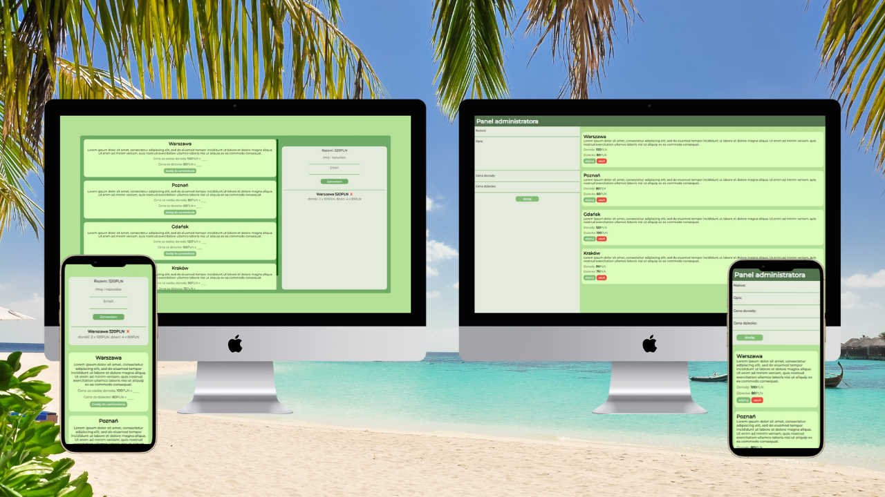

# Trip Booking App



&nbsp;

### Contents:

- [Overview](#mag-overview)
- [Technologies](#bulb-technologies)
- [Installation](#cd-installation)
- [Contact](#wave-feel-free-to-contact-me)
- [Special thanks](#clap-special-thanks)

&nbsp;

## :mag: Overview

**Trip Booking App** is a tool that consists of two elements. The client site allows you to order trips, which are added to the database. Admin site allows you to manage trips. This is made possible by the [fake-server](https://github.com/kubaparol/fake-json-server-heroku).

:fire: Click to see the live versions:

- [Client site](https://kubaparol.github.io/trip-booking-app/index.html)
- [Admin site](https://kubaparol.github.io/trip-booking-app/admin.html)

#### :boy: As a client, you can:

- add trips to the basket
- preview basket
- remove trips from the basket
- place an order

#### :construction_worker: As a admin, you can:

- view trips saved in the database
- add new trips
- edit saved trips
- remove trips

#### Data entered by client and admin are validated

&nbsp;

## :bulb: Technologies


&nbsp;

## :cd: Installation

### You can run the project locally 

- First you need to clone the project

``` 
git clone
```

- Then install all necessary packages

```
npm i
```
- Start developers mode

```
npm start
```

- Now you can go to:

    - client site
    
    ```
    http://localhost:8080/index.html
    ```
    - admin site
    
    ```
    http://localhost:8080/admin.html
    ```
    - database

        - trips
        ```
        https://fake-database-server.herokuapp.com/excursions
        ```

        - orders
        ```
        https://fake-database-server.herokuapp.com/orders
        ```

&nbsp;

## :wave: Feel free to contact me

You can find me here:

- [LinkedIn](https://www.linkedin.com/in/jakub-parol/)
- [GitHub](https://github.com/kubaparol)

&nbsp;

## :clap: Special thanks

Special thanks to my [Mentor - devmentor.pl](https://devmentor.pl/) - for providing me with this task and for code review.
